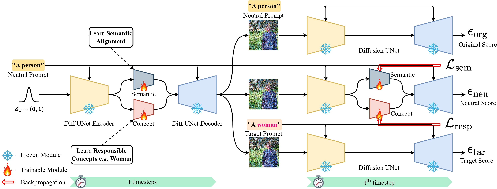

# RespoDiff: Dual-Module Bottleneck Transformation for Responsible & Faithful T2I Generation

This repository contains the official code for our **NeurIPS 2025** paper:  **RespoDiff: Dual-Module Bottleneck Transformation for Responsible & Faithful T2I Generation**

<p align="center">
  <a href="https://arxiv.org/abs/2509.15257">
    
  </a>
  <a href="https://vssilpa.github.io/respodiff_project_page/">
    
  </a>
</p>

## Overview

 We propose RespoDiff, a novel framework for responsible text-to-image generation that incorporates a dual-module transformation on the intermediate bottleneck representations of diffusion models. Our approach introduces two distinct learnable modules: one focused on capturing and enforcing responsible concepts, such as fairness and safety, and the other dedicated to maintaining semantic alignment with neutral prompts. To facilitate the dual learning process, we introduce a novel score-matching objective that enables effective coordination between the modules. Our method outperforms state-of-the-art methods in responsible generation by ensuring semantic alignment while optimizing both objectives without compromising image fidelity.  




## Installation

To create the environment from the provided YAML file:

```bash
conda env create -f respodiff.yml
conda activate respodiff
```

## Training

We provide training scripts under the [`scripts/`](scripts/) directory.  
Each script corresponds to a different training configuration:

```bash
# Train RespoDiff for gender concepts
bash scripts/gender.sh
# Train RespoDiff for race concepts
bash scripts/race.sh
# Train RespoDiff for safety concepts
bash scripts/safe.sh
```

## Evaluation

We provide evaluation scripts under the [`scripts/`](scripts/) directory. Each script corresponds to evaluating a specific aspect such as gender, race and safety:

```bash
# Evaluate gender results
bash scripts/gender_eval.sh
# Evaluate race results
bash scripts/race_eval.sh
# Evaluate safety results
bash scripts/safe_eval.sh
```
Pretrained models for evaluation are available here: [RespoDiff pretrained models](https://drive.google.com/drive/folders/1nE7bz3t78jUyekoXQOEOGAXr04i-6jB8?usp=sharing)

## Acknowledgements


- This repository builds upon prior open-source implementation in [Self-Discovering Interpretable Diffusion Latent Directions for Responsible Text-to-Image Generation](https://github.com/hangligit/InterpretDiffusion)
- Evaluation pipeline is adapted from [Erasing Concepts in Diffusion Models](https://github.com/rohitgandikota/erasing)

## Citation

If you find this work useful, please consider citing:

```bibtex
@misc{sreelatha2025respodiffdualmodulebottlenecktransformation,
      title={RespoDiff: Dual-Module Bottleneck Transformation for Responsible & Faithful T2I Generation}, 
      author={Silpa Vadakkeeveetil Sreelatha and Sauradip Nag and Muhammad Awais and Serge Belongie and Anjan Dutta},
      year={2025},
      eprint={2509.15257},
      archivePrefix={arXiv},
      primaryClass={cs.CV},
      url={https://arxiv.org/abs/2509.15257}, 
}
```

## License

This project is licensed under the **MIT License** – see the [LICENSE](LICENSE) file for details.
